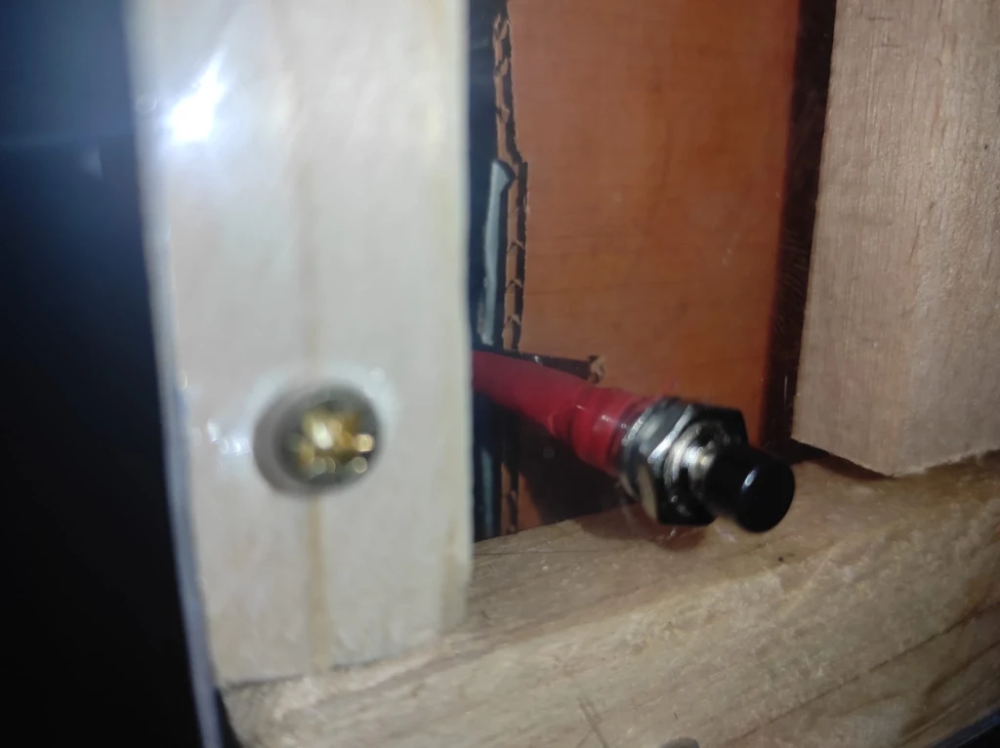
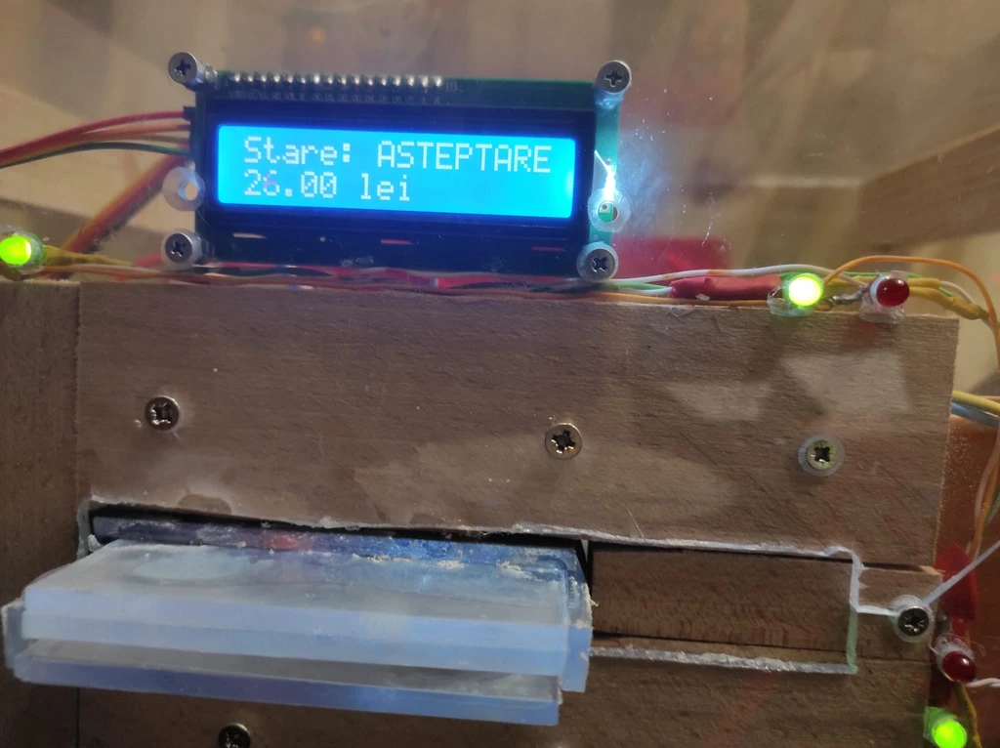
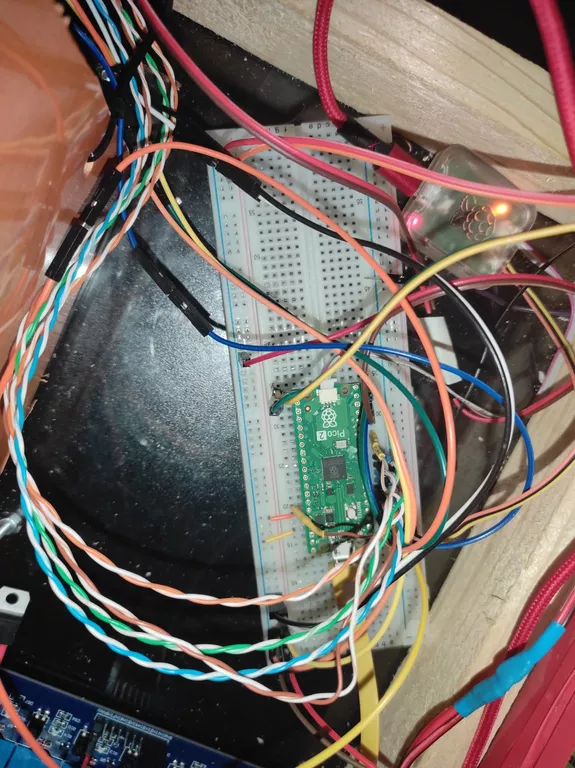
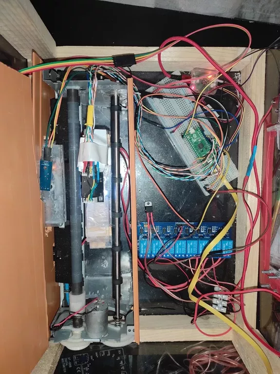
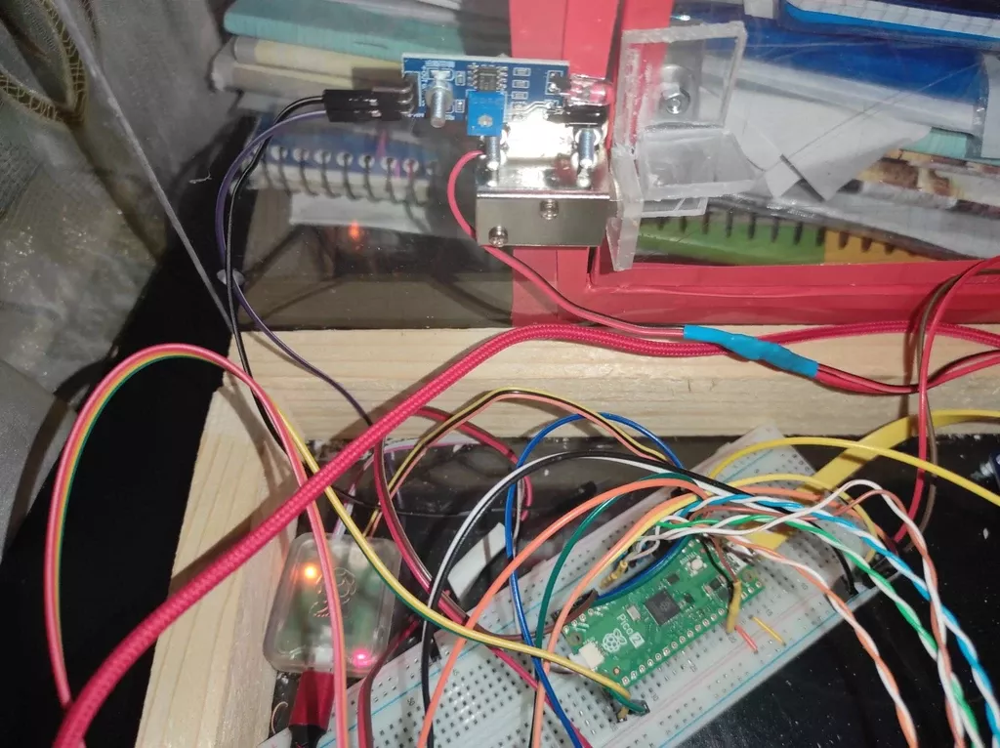
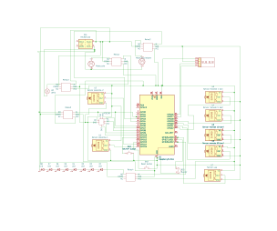

# Money counting machine with coin and bill storage


The project is about counting banknotes and coins which are identified through
sensors and then display the total sum inserted.

:::info

**Author**: Boncan Dragoş-Eduard-Gabriel

**GitHub Project Link**: https://github.com/UPB-PMRust-Students/proiect-Dragos112358

:::


## Description

The purpose of this project is to build an automated machine for counting
Romanian banknotes of various denominations (1, 5, 10, 50, 100, 200, and 500
lei). The device will automatically detect and recognize each inserted banknote
using specialized sensors that identify color, size or other distinctive
features. After recognition, the value of the banknote will be added to a
running total, which is displayed in real time on a 4-digit 7-segment display.
The system allows continuous insertion of multiple banknotes and when a reset
button is pressed, the total sum is reset to zero and the small door at the back
of the machine is unlocked, granting access to the storage compartment. Thus,
the machine functions both as a fast-counting system and as a temporary security
mechanism for the banknotes until the reset button is pressed.


## Motivation

I chose to develop this project because it combines several areas of personal
interest, such as electronics, programming, and real-time data processing. The
idea of creating a device capable of automatically recognize and process
banknotes is an exciting technical challenge that involves both circuit design
and the development of identification algorithms. Moreover, such a device has
practical applications in fields like commerce or financial security to reduce
human error and increase efficiency.


## Architecture

Main Components:

1) Banknote Identification System

– Responsible for identifying banknotes.

– At the hardware level, it includes printer rollers, a printer motor, a TCS230
color sensor with 4 LEDs connected to GPIO pins 6, 7, 8, and 9, and two presence
sensors connected to GPIO pins 14 and 15. The motor is powered at 12V and
receives control signals via GPIO pin 4.

2) Raspberry Pi Pico 2 Board

– Mounted on a 830-pin breadboard.

3) Display Module

– A 4-digit 7-segment display used to show the current amount (in Romanian leu
and bani).

4) Reset and Access Control Module

– A reset button that, when it is pressed, resets the displayed amount and
unlocks the back door. There will also be an on/off button to power the system
on or off.


Connections Between Components:

-The Pico board is mounted on an 830-point breadboard.

-All components are controlled from the Pico; the motor driving the rollers and
the lock are activated via 3.3V-controlled relays.

-GPIO pins 6, 7, 8, 9, and 10 are used for communication with the TCS230 color
sensor.

-GPIO pin 3 controls the electromagnetic lock (it opens when reset is pressed)
-GPIO pin 4 controls the motor that drives the rollers through Relay 1.

-GPIO pin 5 controls the lightbulb inside the dark chamber, where banknote reading is made

-GPIO pin 15 receives data from the first presence sensor (when a banknote is
detected, the motor starts → GPIO 4 is set to high).

-GPIO pin 14 receives data from the second presence sensor (stops the banknote
inside the box for RGB reading).

-GPIO pins 19, 20, 21, and 22 are used for presence sensors for 1, 5, 10, and 50
bani coins, respectively (they increment the value when a coin passes).
-The LCD 1602 uses only 2 pins from the MCU, 16 for SDA and 17 for SCL (LCD 1602 uses I2C as communication protocol)

-GPIO pin 11 is an input pin for the ON/OFF button, helping reduce power
consumption.

-GPIO pin 13 is an input pin for the RESET button. When pressed, the rear door
unlocks, the displayed total resets to 0, and the user can collect the stored
money.


## Log:


### Week 10 April – 16 April

-I purchased the Raspberry Pi Pico 2 board and debugger and connected them.

-I successfully ran the first cargo run, which displayed “Hello World!”.

-I configured the TCS230 color sensor (used GPIO pins 6, 7, 8, and 9 as outputs
and pin 10 as input).

-RGB values are correctly displayed in the program for different environments.


### Week 17 April – 23 April:

-I wrote code to integrate presence sensors into the project (programmed GPIO
pins 14 and 15).

-I modified the code to implement the banknote counting machine as a state
machine (with states: Idle, Start, Stop, Read, and Eject).

-I used a relay to correctly control the motor that pulls banknotes using
rollers.


### Week 24 April – 1 May:

-I wrote the project documentation, including all used components and the KiCad
schematic.

-I tested the TCS230 color sensor in a dark environment (inside a box) to
consistently read the same color for banknotes, minimizing the effect of ambient
light.


### Week 1 May – 7 May:

-I connected the presence sensors to pins 19, 20, 21, and 22 for the 4 types of 
coins (1 ban, 5 bani, 10 bani, and 50 bani).

-I calibrated the presence sensors to detect objects at the correct distance 
(initially, they were detecting at too great a distance).

-I built the coin separator (mechanical part).

-I tried to program a 7-segment display to work via the SPI protocol (I stayed 
in the lab until 11 PM on May 9th).

### Week 8 May – 14 May:

-I purchased a new LCD display (lcd1602), which works via I2C.

-I used [`embassy_rp::peripherals::I2C0`](https://docs.rs/embassy-rp/latest/embassy_rp/peripherals/struct.I2C0.html) 
to make it functional.

-The display has GND, VCC, SDA, and SCL connections.

-I used pins 16 and 17 on the Pico for SDA and SCL.

-It can now display all kinds of characters (letters, numbers, and punctuation).

-I built a new banknote slot (the old one was too long and the banknotes didn’t align properly with the rollers).

-I added a door sensor to detect whether it is open or closed (not yet connected to the board).

### Week 15 May – 21 May:
-I connected the door sensor to pin 26 (configured as an input pin).
-I used an active buzzer, which operates between 3–24V. I powered it with 12V, connected to the fourth channel of the relay. The buzzer receives the control signal from pin 27 of the Pico (configured as an output pin).
-I also connected pin 28 to the LEDs.
-On the NC (normally closed) contact, the relay is deactivated, the green LEDs are on, and the red LEDs are off.
-On the NO (normally open) contact, the relay is activated, the green LEDs are off, and the red LEDs are on.
-I used 4 LEDs of each color to clearly indicate the current state of the system (green for standby mode and red for reading or banknote removal mode).

### Week 22 May - 28 May:
-I used GPIO 2 to control the motor in the reverse direction.
-If the banknote is not within the predefined value range, it will be considered invalid and will be rejected.
-The magnetic lock is connected to GPIO 3.
-When the reset button is pressed, the door opens and the buzzer starts beeping.
-The buzzer stops only when the door is closed.
-I made several software updates for banknote detection.


## Hardware

The hardware design of the project includes a Raspberry Pi Pico 2 with 2 MB
Flash and 264 KB RAM, powered by a step-down 3.3V–5A power supply. An 8-channel
opto-isolated relay module (3.3V compatible) is used to control external
devices. Banknotes are recognized using a TCS230 color sensor, while detection
of coins and banknotes is done through 8 infrared obstacle sensors. Connections
between components are made with female-to-male jumper wires, and the security
of the collected banknotes is ensured by an electromagnetic lock.


### [Motor](https://www.aliexpress.com/i/4001294507915.html)
-A component used to spin the roles to take the banknote inside

-it works at 9V, so I have a LM7809 between the 12V source and the motor

-it can spin both ways

-can eject banknote if it is not recognized by the color sensor

### Relay
-I used a [relay](https://ampul.eu/cs/rele-magneticke-kontakty/3941-modul-8-rele-s-optickym-oddelenim-33v) with 3.3V command and 8 channels, because PICO can give output only up to 3.3V. So, a 5V relay will not work.

-I used the first 4 channels. First channel is from pin 4 (output) that controls the motor. Second one is for light bulb (pin 5), that activates only when I read the banknote. 

-the third channel is for electromagnetic lock.

-the fourth one is used for the motor (but this time backwards).

### [TCS230 color sensor](https://www.optimusdigital.ro/en/optical-sensors/1854-blue-tcs230-color-sensor-module.html?gad_source=1&gad_campaignid=20868596392&gbraid=0AAAAADv-p3C89WEw3rF-wI7dDqJt-i0N-&gclid=CjwKCAjw_pDBBhBMEiwAmY02Nn7UqWH3XvXoJSabxmtseDuVm4aQH_EgTjFWKfGaQxev41fdBL5hEBoCsW4QAvD_BwE)
-used to see colors for banknotes

-it uses 5 pins on my Pico (4 for input, one for output)

-I made a dark chamber for this sensor, because it may get influenced by the outside light.

-It has 8 pins(S0,S1,S2,S3 input in the sensor, out is input in the MCU on pin 10, gnd, vcc and output enable)

### [Presence sensors with infrared](https://www.optimusdigital.ro/en/optical-sensors/4514-infrared-obstacle-sensor.html?search_query=infrared&results=156)
-the best option to check if something moved.

-I calibrated them using a screwdriver, each of them can detect objects up to 2 cm in front of them

-Each sensor has 3 pins: VCC, GND and OUT. OUT goes in my MCU on the INPUT pins.

### [1602 LCD](https://www.optimusdigital.ro/en/lcds/2894-1602-lcd-with-i2c-interface-and-blue-backlight.html?gad_source=1&gad_campaignid=20868596392&gbraid=0AAAAADv-p3C89WEw3rF-wI7dDqJt-i0N-&gclid=CjwKCAjw_pDBBhBMEiwAmY02NhSRhh6ZWsS9qRrYm8ebIyKZ_fdj1R9oZmFWQkiGQcS6CHtxoeJvFxoCkyoQAvD_BwE)
-It uses only 2 pins from my MCU (pin 16 SDA and pin 17 SCL)

-It comunicates via I2C, at a frequency of 100KHz.

-It prints any characters I need


### Reserved Pins
Pins 0, 1, and 2 are unavailable as they are used by the SC0889 debugger, which is Raspberry Pi compatible.
Pin 2 is GND, and it is also connected to the debugger.

### Outputs
#### Pin 2 - Motor Control (Backward)
-Controls the backward motion of a motor (HP model [RK-370CA-14420](https://datasheet4u.com/pdf-down/R/K/-/RK-370CAMABUCHI.pdf)). When the banknote can't be recognized by my sensor, the pin 4 becomes
inactive and pin 2 becomes active. It spins back for 0.5 seconds in order to eject the banknote.
#### Pin 3 – Electromagnetic Lock Control
-Acts as a GPIO output.

-LOW: Lock is engaged (closed).

-HIGH: Lock is disengaged (open).

#### Pin 4 – Motor Control (Forward)
-Controls the forward motion of a motor (HP model [RK-370CA-14420](https://datasheet4u.com/pdf-down/R/K/-/RK-370CAMABUCHI.pdf)).
When the presence sensor in the slot (connected to pin 15) detects a banknote, the motor is activated.
The banknote is pulled in until a second presence sensor (connected to pin 14) detects it.
Once detected, the motor stops, and the TCS230 color sensor begins reading the banknote.

#### Pin 5 – 12V Light Control
Powers a 12V light.

The light turns on during the banknote reading process.

#### Pin 27 – Buzzer Control
-Controls a buzzer.

-Activated when the door is open or under error conditions.

#### Pin 28 – Status LEDs
-Controls red LEDs when the machine is working or the door is open.
Controls green LEDs when the machine is in standby mode.

### [TCS230 Color Sensor](https://www.optimusdigital.ro/en/optical-sensors/1854-blue-tcs230-color-sensor-module.html?gad_source=1&gad_campaignid=20868596392&gbraid=0AAAAADv-p3C89WEw3rF-wI7dDqJt-i0N-&gclid=CjwKCAjw_pDBBhBMEiwAmY02Nn7UqWH3XvXoJSabxmtseDuVm4aQH_EgTjFWKfGaQxev41fdBL5hEBoCsW4QAvD_BwE)
-The TCS230 sensor uses a 100 kHz PWM signal to analyze the colors of the banknotes, allowing for a quick response during processing.

-Outputs a PWM (Pulse-Witdh Modulation) signal (frequency modulation).

-Pins 6 and 7 (Output): Control the output frequency.

-Pins 8 and 9 (Output): Control color filter selection.

-Pin 10 (Input): Receives RGB data.

### Inputs
#### Pin 11 – On/Off Button:
-Used for low-power toggling of the device.

#### Pin 13 – Reset Button:
-When pressed, it sends a command via Pin 3 to open the lock.

-The screen displays 0 for the sum introduced.

-If the door sensor becomes inactive, the buzzer is triggered for 0.5 seconds with a 1-second pause.

### [Presence Sensors](https://www.optimusdigital.ro/en/optical-sensors/4514-infrared-obstacle-sensor.html?search_query=infrared&results=156)
-In this project, I use 7 presence sensors. There are 4 for coins, 2 for banknotes and one for door.

-I calibrated these presence sensors using a screwdriver.

-I have set the sensors to not detect beyond 2 cm, because they can interfere with the materials around them.

##### Pin 14 (Input):
-Connected to the second presence sensor (near TCS230).

-Detects the arrival of the banknote and signals the MCU to stop the motor.


#### Pin 15 (Input):
-Connected to the first presence sensor (inside the banknote slot).

-Activates the motor to start pulling the banknote.

#### Pins 19, 20, 21, 22 (Input):
-Connected to four presence sensors, each detecting a different coin type (1, 5, 10, 50).

#### Pin 26 (Input):
-Door sensor: If no presence is detected, the door is considered open, and the buzzer must be activated.

### [LCD Display – 1602 (2 Rows × 16 Characters)](https://www.optimusdigital.ro/en/lcds/2894-1602-lcd-with-i2c-interface-and-blue-backlight.html?gad_source=1&gad_campaignid=20868596392&gbraid=0AAAAADv-p3C89WEw3rF-wI7dDqJt-i0N-&gclid=CjwKCAjw_pDBBhBMEiwAmY02NhSRhh6ZWsS9qRrYm8ebIyKZ_fdj1R9oZmFWQkiGQcS6CHtxoeJvFxoCkyoQAvD_BwE)
-Pins 16 (SDA) and 17 (SCL)

-Used for I2C communication with the LCD via a PCF8574 expander.

-The 1602 LCD uses a transmission speed of 100 kHz for I2C communication, ensuring a quick update of the information on the display.

#### Initialization:
-The display is initialized using a custom lcd_init function.

#### Data Transmission:
-I used this datasheet to see exactly how lcd 1602 actually works: [datasheet LCD 1602](https://www.waveshare.com/datasheet/LCD_en_PDF/LCD1602.pdf)

-Each byte is split into high nibble and low nibble

-Each nibble is sent in two steps: With EN signal activated (with_en) and With EN signal deactivated (without)

-After transmitting a full byte, the system waits 2 ms before continuing.


### Power consumption
I have 2 circuits:

-one at 5V, including Raspberry Pi Pico, TCS230 Color Sensor,all 7 presence sensors and the lcd 1602

-one at 12V, featuring the engine, the lightbulb and some other leds.

-P = U * I 
|       Device        | Tension (V) | Current Intensity (mA) | Used Power (W) |
|:-------------------:|:-----------:|:------------------------:|:--------------:|
| TCS230 Color Sensor |     5V      |           2             |     0.01       |
| IR Presence Sensors (×7) |   5V      |       7 × 20 = 140       |     0.70       |
| LCD 1602 with I2C   |     5V      |           30            |     0.15       |
| **Subtotal (5V)**   |     -       |          172            |     0.86       |
|                     |             |                          |                |
| Printer Motor (RK-370CA) |  12V     |          250            |     3.00       |
| 12V Light (LED)     |    12V      |          200            |     2.40       |
| Extra LEDs (×4)     |    12V      |       4 × 20 = 80        |     0.96       |
| **Subtotal (12V)**  |     -       |          530            |     6.36       |
|                     |             |                          |                |
| **TOTAL**           |     -       |         ~702             |     ~7.22      |


## Hardware images

### Reset button



### Working LCD 1602



### Hardware overall



### Breadboard with Raspberry Pi Pico 2



### Lock with presence sensor for the door




## Schematics




## Bill of materials


|               Device               |                            Usage                                 | Unit Price (Ron) | Quantity | Total Price (Ron) |
|:----------------------------------:|:--------------------------------------------------------------:|:-----------------:|:--------:|------------------:|
| [Raspberry Pi Pico 2](https://www.tme.eu/ro/details/sc1632/raspberry-pi-sisteme-incorporate/raspberry-pi/raspberry-pi-pico-2-with-header/)               | Microcontroller                                                 |        27         |     1    |         27        |
| [Debugger for Raspberry Pi](https://www.tme.eu/ro/details/sc0889/raspberry-pi-accesorii/raspberry-pi/debug-probe/)         | Hardware-level debugging and coding                             |        55         |     1    |         55        |
| [8 channel relay module](https://ampul.eu/cs/rele-magneticke-kontakty/3941-modul-8-rele-s-optickym-oddelenim-33v)            | To control the lock and the motor that drives the rollers.     |        85         |     1    |         85        |
| [3.3V 5A DC-DC buck converter](https://www.emag.ro/sursa-de-alimentare-profesionala-12v-5a-100-240v-50-60hz-valabil-si-pentru-internet-modem-mv5a12v/pd/DCZX48YBM/?X-Search-Id=8411c119cfae6a7e6c46&X-Product-Id=218016933&X-Search-Page=1&X-Search-Position=24&X-Section=search&X-MB=0&X-Search-Action=view)      | Power microcontroller when not connected to PC                  |        18         |     1    |         18        |
| [Color sensor TCS230](https://www.optimusdigital.ro/en/optical-sensors/111-tcs230-color-sensor-module.html?search_query=tcs230&results=2)              | Recognize banknotes based on their color (RGB)                  |        39         |     1    |         39        |
| [Infrared obstacle detection sensor](https://www.optimusdigital.ro/en/optical-sensors/4514-infrared-obstacle-sensor.html?search_query=infrared&results=156)| 4 for coins (4 types of coins), 2 for banknotes and 1 for my electromagnetic lock | 3.5 | 8 | 28 |
| [Male-female wires (40 x)](https://www.optimusdigital.ro/en/wires-with-connectors/92-female-male-wire40p-20-cm.html?search_query=0104210000001792&results=1)          | To connect all my circuits, including Pico with all the sensors |        8          |     2    |         16        |
| [Electromagnetic lock](https://www.emag.ro/broasca-electrica-pin-retractabil-12v-24x55x28-mm-2-e-052/pd/DXXN01MBM/)              | To secure all the money inserted while reset button is not pressed | 12        |     1    |         12        |
| [Plexiglass](https://www.dedeman.ro/ro/placa-hobbyglas-transparent-1000-x-500-x-4-mm/p/6019007)                        | For the enclosure housing the hardware components               |        70         |     1    |         70        |
| [4-digit 7 segment display](https://www.emag.ro/afisaj-cu-7-segmente-8-cifre-spi-83x15-mm-max7219-digits-red/pd/D7Z798MBM/)         | Display the total sum stored in the safe                        |        18         |     1    |         18        |
| [830 points Breadboard](https://www.emag.ro/set-componente-electronice-breadboard-830-puncte-led-uri-compatibil-arduino-si-raspberry-pi-zz00044/pd/DRXG4XYBM/)             | For prototyping the entire circuit                             |         20         |     1    |    20        |
| [All purpose leds](https://www.emag.ro/set-componente-electronice-breadboard-830-puncte-led-uri-compatibil-arduino-si-raspberry-pi-zz00044/pd/DRXG4XYBM/)                  | Status indicators (e.g., power, validation, errors)            |         0.7        |     20   |             14        |
| [Buzzer](https://www.emag.ro/set-componente-electronice-breadboard-830-puncte-led-uri-compatibil-arduino-si-raspberry-pi-zz00044/pd/DRXG4XYBM/)                            | For audio feedback (e.g., valid/invalid banknote or coin)      |         5          |      1   |             5         |
| [LCD 1602](https://www.waveshare.com/datasheet/LCD_en_PDF/LCD1602.pdf) | I used an LCD 1602 with I2C to display the total amount of money stored in the safe, as well as the current state of the device (waiting, reading, open, closed). | [15](https://www.optimusdigital.ro/en/lcds/2894-1602-lcd-with-i2c-interface-and-blue-backlight.html) | 1 | 15 |
| **Total cost** |  |  |  | **422** |


## Software


The code I wrote controls a system on the Raspberry Pi Pico 2 for detecting
banknotes. It uses presence sensors to detect when a banknote is inserted, and a
TCS230 color sensor to read its RGB values. The motor is started or stopped
based on the banknote’s position, and the RGB frequencies are normalized to
identify the note’s color. The code handles concurrent tasks and delays using
libraries like embassy_executor and embassy_time.


### Current Status of the Software Implementation

My project is almost finished; I still need to implement the calibration of the 
color sensor (TCS 230) using a sheet of paper. On a white sheet, it should consistently 
display equal RGB values. In the code, I also need to have appropriate constants for the colors.


### Libraries used

|     Library      |                      Description                       |                            Usage                            |
|:----------------:|:------------------------------------------------------:|:-----------------------------------------------------------:|
| [embassy_executor](https://docs.embassy.dev/embassy-executor/git/std/index.html) | Asynchronous runtime for microcontrollers              | Run async fn main() and defines asynchronous tasks, such as bancnote_task and monede_task |
| [embassy_time](https://docs.rs/embassy-time/latest/embassy_time/)     | Time management: delays, timers, time instants.        | Used for delays with Timer::after() and time measurements with Instant::now(). |
| [defmt](https://docs.rs/defmt/latest/defmt/)            | Efficient logging library for embedded systems.        |                             defmt is used to log internal states                                |
| [panic_probe](https://docs.rs/panic-probe/latest/panic_probe/)      | Panic handler – displays debug information on panic in embedded mode. | Handles potential runtime panics during execution.      |
| [embassy_rp::gpio](https://docs.embassy.dev/embassy-rp/git/rp2040/index.html) | GPIO pin control on the Raspberry Pi Pico (RP2040)     | Defines and controls pins as output (using Output) or input (using Input). |
| [embassy_rp::init](https://docs.embassy.dev/embassy-rp/git/rp2040/index.html) | Initializes RP2040-specific peripherals               | let p = init(...) — make objects for all pins and peripherals. |
| [embassy_rp::i2c](https://docs.embassy.dev/embassy-rp/git/rp2040/i2c/struct.I2c.html) | I2C is a two-wire communication protocol that enables data exchange between multiple devices using a shared bus.| Define the asynchronous I2C interface to enable communication between the board and the LCD 1602.  |
| [embassy_rp::peripherals::I2C0](https://docs.embassy.dev/embassy-rp/git/rp235xa/struct.Peripherals.html#structfield.I2C0)|It provides access to the I2C0 peripheral on Raspberry Pi RP2040, enabling communication with I2C devices such as sensors and displays | Initializes I2C instance asynchronous: let mut i2c = I2c::new_async(p.I2C0, scl, sda, Irqs, config)|
|  [embedded_hal_async::i2c::I2c as AsyncI2c](https://github.com/rust-embedded/embedded-hal/blob/master/embedded-hal-async/src/i2c.rs)| Defines the asynchronous interface for I2C communication in embedded systems.| I used it for asynchronous functions using I2C(lcd_init, lcd_command, lcd_data, lcd_write_str)|
|         [heapless::String](https://docs.rs/heapless/latest/heapless/struct.String.html)        |  A fixed-capacity string type for no_std environments  |    Used for efficient string handling without heap allocation(I need to write some strings on my lcd 1602)  |
|  [num_traits::float::FloatCore](https://docs.rs/num-traits/latest/num_traits/float/trait.Float.html)  | Provides floating point core traits and math operations |     I used it to help calculate euclidian distance between the color identified by my TCS230 and the banknote    |
|      [ufmt::{uwrite, uWrite}](https://docs.rs/ufmt/latest/ufmt/trait.uWrite.html)     | A minimal formatting crate for no_std and embedded use |   Used for formatting output to custom writes. I used to display "lei" after the total sum of money.  |
|            [core::f32](https://doc.rust-lang.org/core/f32/index.html)            |     Core floating-point types from Rust core library    |         Used for float32 operations in a no_std context, I used it several times to normalize my RGB values and to compute different calculations for total sum displayed        |
|            [libm::sqrt](https://docs.rs/libm/latest/libm/fn.sqrt.html)           |     Math library providing sqrt and other math funcs    | Used to compute square root. I needed to calculate the euclidian distance, so I need sqrt function. |
| [core::sync::atomic::{AtomicU32, Ordering}](https://doc.rust-lang.org/core/sync/atomic/struct.AtomicU32.html) | Provides atomic integer types and memory ordering primitives. | Used for thread-safe atomic operations. I used it to be able to have 2 global variables: GLOBAL_FLOAT_BITS and GLOBAL_MACHINE_STATE|


### Highlighting the Innovation Element of the Project 
The detection and classification of banknotes using a TCS230 color sensor calibrated in a dark environment is the innovation brought by my project. I have a bidirectional mechanical handling system for real-time acceptance/rejection. Additionally, the 1602 LCD screen updates in real time.

#### Why is it innovative?
Most commercial complex devices use high-resolution cameras or specialized sensors (multi-point infrared, UV, magnetic) that are expensive for verifying banknote authenticity. I use a simple and affordable color sensor (TCS230), precisely calibrated inside a dark chamber, combined with a simple colorimetric recognition algorithm that enables fast and cost-effective identification of Romanian banknotes based on their specific colors.

#### How is it different?
Existing devices use much more complex and costly methods; my approach offers an excellent compromise between cost and efficiency, opening the way for low-cost devices dedicated to the local market with a minimalist hardware/software implementation.

###  Use of Laboratory Functionalities within the Project

Throughout the semester, I applied the following functionalities from the labs in my project:

#### 1. Lab 2 – GPIO
-I used GPIO functionality for almost all the pins (except pins 16 and 17, which are used for I2C communication with the LCD display).

```
let led0 = Output::new(p.PIN_4, Level::High); // my printer motor  
let led1 = Output::new(p.PIN_5, Level::High); // my internal lightbulb
```

#### 2. Lab 3 – PWM and ADC
I only used PWM, specifically on pin 10 of the Raspberry Pi Pico. This pin receives a PWM signal from the TCS230 sensor, which represents the measured RGB values.
I use the function:
```
async fn read_frequency(out: &Input<'_>, duration_ms: u64) -> u32
```

#### 3. Lab 4 – Asynchronous Development
I use asynchronous functions throughout the project to ensure the Pico is non-blocking. Without asynchronous functions, I wouldn’t be able to insert a coin and a banknote simultaneously.
I spawn the following tasks using the spawner:

```
spawner.spawn(bancnote_task(led0, led1, s2, s3, out, presence_sensor1, presence_sensor2, leds)).unwrap();
spawner.spawn(monede_task(moneda_sensor1, moneda_sensor5, moneda_sensor10, moneda_sensor50)).unwrap();
spawner.spawn(reset_task(buton_reset, door_lock)).unwrap();
spawner.spawn(lcd_task(i2c, lcd_addr)).unwrap();
spawner.spawn(buzzer_usa_deschisa(door_sensor, buzzer)).unwrap();
```

#### 4. Lab 6 – Inter-Integrated Circuit (I2C)
I used pins 16 and 17 as SDA and SCL for the LCD1602 display:

```
let mut i2c = I2c::new_async(p.I2C0, scl, sda, Irqs, config);
```

### Project Structure
The project is built using the Rust programming language along with the Embassy library for asynchronous programming. Here are my main tasks explained

### Bancnote_task

This contains the logic behind activating/deactivating the motor. It uses a state machine that handles the different states involved in processing a banknote.
```
#[derive(PartialEq)]
enum StareMotor {
    Idle,
    Start,
    Read,
    Eject,
    Rejected,
}
```

The ```Idle``` state is the default state. In this state, the two presence sensors are inactive, and the motor is turned off. The system can only transition to the ```Start```  state from here.

The ```Start``` state is where the motor becomes active. The transition from idle to start occurs if the first sensor detects a banknote. If no banknote is inserted within 4 seconds, the motor stops and the system returns to the ```Idle``` state. If a banknote is inserted, the system automatically transitions to the ```Read```  state.

The ```Read``` state involves reading and identifying the color on the banknote. It uses the following function:
```set_filter(&mut s2, &mut s3, "red").await;```
This sets the color filter using the s2 and s3 pins of the TCS230 color sensor:

| Color Filter | S2   | S3   |
|--------------|------|------|
| Red          | Low  | Low  |
| Green        | High | High |
| Blue         | Low  | High |
| Clear        | High | Low  |

Based on the detected color, the Euclidean distance between the reference color and the measured one is calculated. The color values are normalized by dividing them by the "clear" parameter. The closest match determines the identified banknote.
If the distance is greater than 15, the banknote is considered unrecognized, and the system transitions to the ```Rejected``` state. If the banknote is identified, it transitions to the ```Eject``` state.

In the ```Rejected``` state, the motor reverses direction for one second to push the banknote out. Afterward, the system waits for 3 seconds in the same state to allow the user to retrieve the banknote. The system returns to the Idle state once the banknote is removed.

In the ```Eject``` state, the motor rotates forward for 1.5 seconds to move the banknote into an internal tray. The amount of money is updated accordingly, and the LCD1602 display shows the updated value.


### Calibration of the sensors

#### Calibration of the presence sensors:
Each presence sensor was tested individually in a controlled environment. I started by identifying the optimal detection threshold, meaning the distance and conditions at which the sensor detects the presence of an object. I adjusted the physical positioning of each sensor to avoid interference and false triggers.

Each presence sensor has a screw at the back. This screw controls how far the sensor can detect presence. I used a small flathead screwdriver. At the maximum setting, my sensors could detect objects at distances that were too large for my needs (10-12 centimeters). I adjusted them close to the minimum, so they would detect banknotes or slips only at about 1.2–1.5 centimeters.

#### Calibration of the color sensor:
My TCS230 color sensor is not very accurate because it doesn’t consistently give the same value for the same position. I tried as much as possible to calibrate it (in software) on a white sheet of paper, so that it would output roughly equal values for the RGB components.

#### Calibration of the display:
Initially, my display didn’t seem to turn on. The reason was that the contrast was set to minimum. Using a flathead screwdriver again, I increased the contrast until the text became clearly visible on the screen.


### Software optimizations

#### 1. Hardware and software debounce for the reset button
In the reset_task, I detect the transition from HIGH to LOW and introduce a short delay (50 ms) to debounce the signal. After the delay, I confirm the button state to avoid false positives caused by mechanical bouncing. This ensures reliable reset triggering without unintended multiple activations.

#### 2. Reducing flicker on the LCD
In the lcd_task, before clearing the LCD screen, I check if the length of the displayed text has decreased compared to before. This prevents unnecessary clearing and reinitializing of the display, which reduces flickering and improves the visual experience.

#### 3. Rate limiting in repetitive loops
In almost all tasks, I use ```Timer::after(Duration::from_millis(20))``` to insert delays between iterations. This prevents aggressive continuous polling, which can overload the CPU and increase power consumption. By limiting the polling rate, I reduce CPU usage and optimize energy efficiency.

#### 4. Conditional checks for global updates
Global variables that hold system state and floating-point values are updated only when a change is necessary. Access to these variables is atomic, using ```AtomicU32``` with ```Ordering::SeqCst``` to avoid race conditions. This approach ensures thread-safe, consistent data without unnecessary writes that could degrade performance or cause bugs.

#### 5. On/off button
I added an on/off button to allow the system to completely power down when not in use. This reduces power consumption by limiting the active operating time, which is critical for battery-powered or energy-sensitive applications.

#### 6. Controlled banknote motor with a clear state machine
The banknote motor is controlled by an explicit state machine with well-defined states and transitions. This structured approach ensures that the motor runs only when needed and in a predictable manner, preventing errors such as motor stalls or unwanted operation, thus improving system reliability and efficiency.


## Links:

[TCS230 datasheet](https://s3-sa-east-1.amazonaws.com/robocore-lojavirtual/889/TCS230%20Datasheet.pdf)

[Mechanical sorting coins](https://www.youtube.com/watch?v=7ILHtAPY29I)

[Datasheet for LCD1602](https://www.waveshare.com/datasheet/LCD_en_PDF/LCD1602.pdf)


